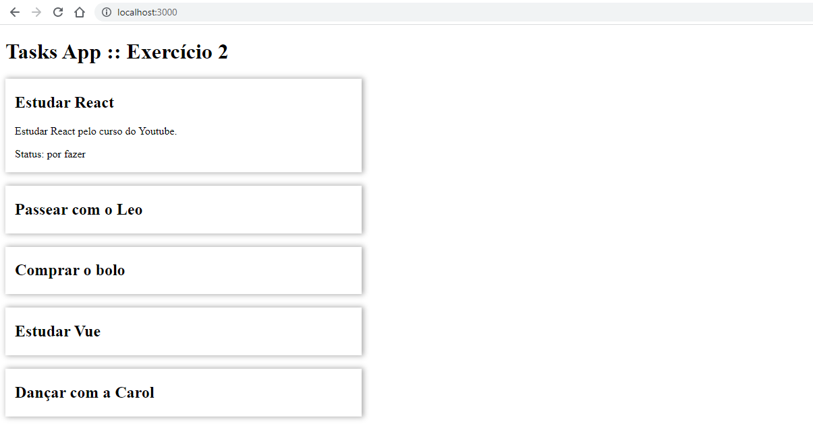

# Tasks App



## How to run?
In project root folder run:
```
npm start
``` 

Aceder ao frontend da app:
```
http://localhost:3000/
```

Endpoints da API:
- /tasks `GET all tasks`
- /tasks/{taskId} `GET task by ID`

Exemplos de endpoint:
- http://localhost:3000/tasks
- http://localhost:3000/tasks/3