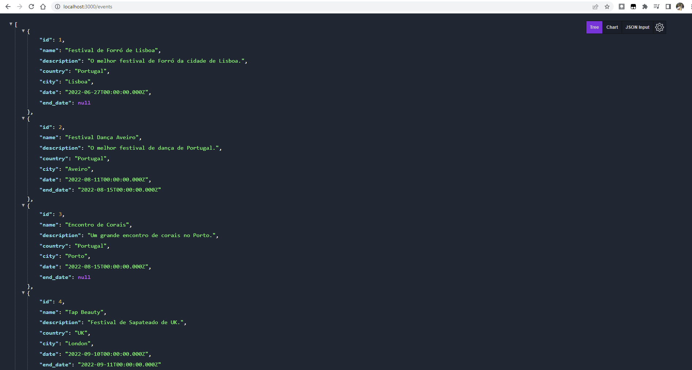

# `API` do Projero da disciplina de Serviços para Aplicações Web e Móveis



## Definição dos endpoints


`Events`
- /events           `GET` list all events
- /events/:id       `GET` list an event by id
- /events           `POST` add new event
- /events/:id       `PUT` edit an event
- /events/:id       `DELETE` remove an event


## Como correr a app


Correr um dos comandos:
- npm start
- npm run dev


## MySQL config


- Instalação do MySQL Server (as a Windows Server)
- Ininiar o serviço MySQL80
- CMD » mysql -u root -p
- Inserir a password do MySQL
- Criar novo user:
```sql
CREATE USER 'dantiii'@'localhost' IDENTIFIED WITH mysql_native_password BY 'xpto';
grant all privileges on *.* to 'dantiii'@'localhost';

-- Ou
CREATE USER 'dantiii'@'localhost' IDENTIFIED BY 'xpto';
grant all privileges on *.* to 'dantiii'@'localhost';
```

## Dados MySQL


Query para criar BD projeto_sawm e inserir dados:
```sql
CREATE DATABASE IF NOT EXISTS projeto_sawm CHARACTER SET utf8 COLLATE utf8_general_ci;
USE projeto_sawm;

CREATE TABLE events (
  id int(11) NOT NULL AUTO_INCREMENT,
  name varchar(70) NOT NULL,
  description varchar(300),
  country varchar(50) NOT NULL,
  city varchar(50) NOT NULL,
  date timestamp NOT NULL,
  end_date timestamp,
  PRIMARY KEY (id)
) ENGINE=InnoDB  DEFAULT CHARSET=utf8 AUTO_INCREMENT=5;

INSERT INTO events (id, name, description, country, city, date, end_date) VALUES
(1, "Forró do Bom", 'O melhor festival de Forró da cidade de Lisboa.', 'Portugal', 'Lisboa', '2022-06-27', null),
(2, "Festival Dança Aveiro", 'O melhor festival de dança de Portugal.', 'Portugal', 'Aveiro', '2022-08-11', '2022-08-15'),
(3, "Encontro de Corais", 'Um grande encontro de corais no Porto.', 'Portugal', 'Porto', '2022-08-15', null),
(4, "Tap Beauty", 'Festival de Sapateado de UK.', 'UK', 'London', '2022-09-10', '2022-09-11'),
(5, "Forró Petit Gateaux", 'O melhor festival de Forró em Paris.', 'France', 'Paris', '2022-11-20', null);
```


## Exemplo de JSON

**POST**
```json
{
    "name": "Super Evento",
    "description": "Um evento no Porto.",
    "country": "Portugal",
    "city": "Porto",
    "date": "2022-08-15",
    "endDate": "2022-08-18"
}
```

**PUT**
```json
{
    "id": 57,
    "name": "Super Evento",
    "description": "Um evento no Porto.",
    "country": "Portugal",
    "city": "Porto",
    "date": "2022-08-15",
    "endDate": "2022-08-18"
}
```

## Problemas possíveis ao instalar os pacotes


Após `npm install`, pode obter erro ENOTFOUND, apresentando um request a uma rede diferente da atual.
`Solução`: forçar a limpeza do cache do NPM:
```
npm cache clean --force
```


## Requisitos


- [x] Listar todos os eventos
- [x] Listar um evento dado o seu ID
- [x] Adicionar um evento
- [x] Atualizar um evento dado o seu ID
- [x] Remover um evento dado o seu ID
- [x] Restaurar o estado inicial da BD


## Regras de negócio da app


- [x] Não pode adicionar evento onde a cidade, país e nome do evento sejam iguais
- [x] Não pode criar evento com data final antes da data inicial
- [x] Não pode criar evento com uma antecedência de mais de dois anos


## Help links

How to subtract date/time in JavaScript?  
https://stackoverflow.com/questions/4944750/how-to-subtract-date-time-in-javascript

Swagger » Describing Responses
https://swagger.io/docs/specification/describing-responses/